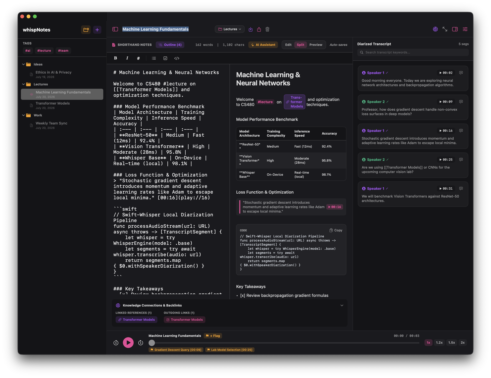
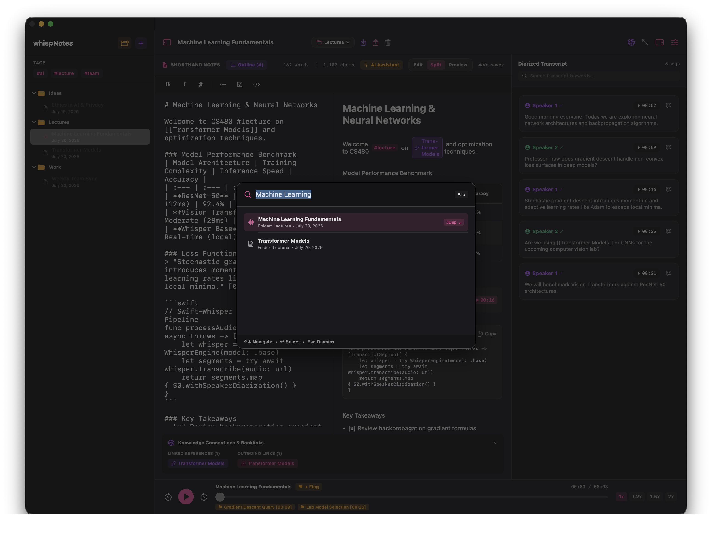

# WhispNotes

WhispNotes is a native macOS application for markdown note-taking with integrated on-device audio transcription. Designed for privacy and offline usage, all note data and speech processing remain local to your machine.

## Interface Preview

### Main 3-Pane Interface


### Spotlight Command Palette (⌘K)


## Key Features

- **Three-Pane Split View**: Navigate notes via the file sidebar, write in the markdown editor with live preview, and view time-synced transcripts in the right panel.
- **On-Device Transcription**: Process audio recordings locally using Whisper without sending data to external servers.
- **Speaker Separation and Time Sync**: View transcripts organized by speaker segments, with active segment highlighting during audio playback.
- **Transcript Blockquotes**: Insert timestamped transcript excerpts directly into notes with a single click.
- **Wiki-Links**: Connect notes using `[[Note Title]]` syntax, enabling fast navigation and automatic note creation.
- **Command Palette**: Search notes, folders, and transcript content using the `⌘K` or `⌘O` shortcut.
- **Integrated Audio Player**: Play, pause, jump back/forward, and adjust playback speed from the persistent bottom player bar.

## System Requirements

- macOS 14.0 (Sonoma) or higher
- Swift 5.9 toolchain

## Building from Source

To build and run the executable locally using Swift Package Manager:

1. Clone the repository to your local machine.
2. Open a terminal in the project directory.
3. Build and launch the application:

```bash
swift run
```

To build a release binary:

```bash
swift build -c release
```

## Storage Location

Application settings and notes are stored locally as JSON in:

`~/Library/Application Support/com.whispnotes.app/`

## Project Architecture

- `Package.swift`: Swift Package Manager manifest specifying macOS target and compilation settings.
- `Sources/main.swift`: Main application entry point, SwiftUI views, audio processing logic, and state management.
- `Info.plist`: Application configuration and metadata.
- `swift_project_spec.md`: Detailed functional and architectural specifications.
- `assets/`: Interface screenshots and visual assets for documentation.
