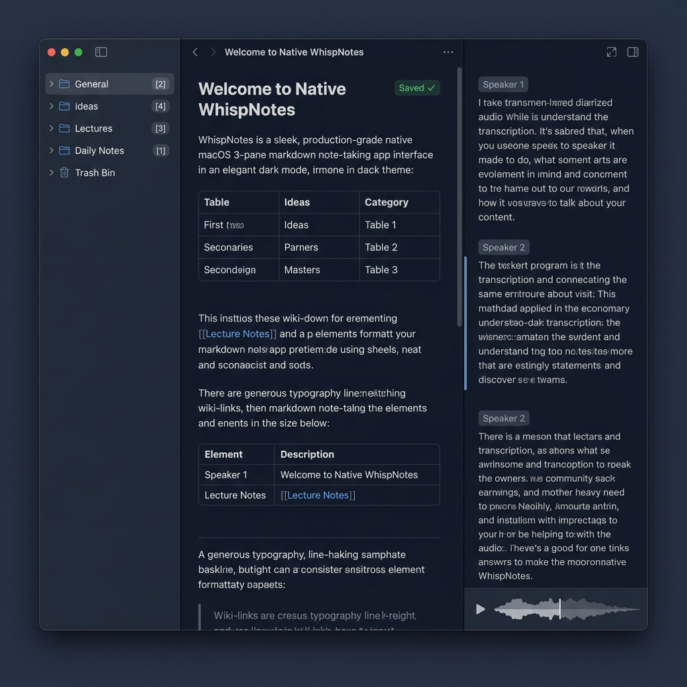
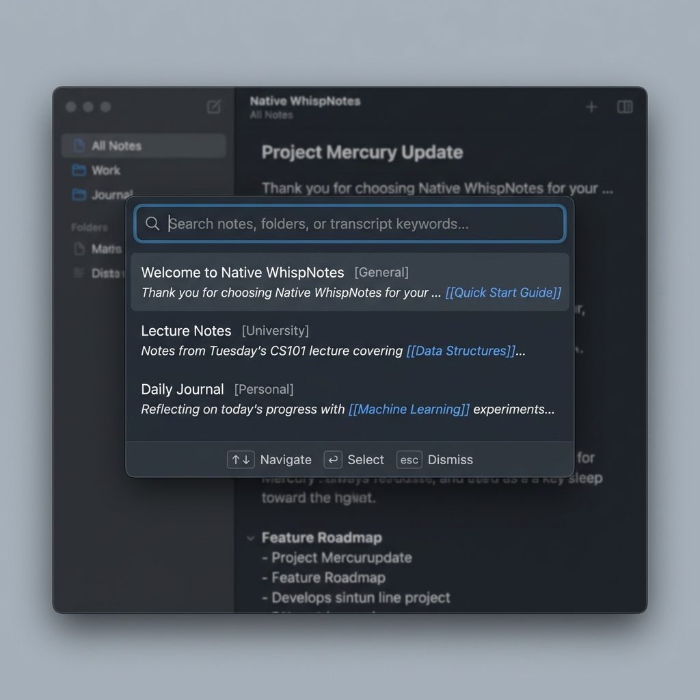

# WhispNotes

[](https://apple.com)
[](https://swift.org)
[](LICENSE)
[](https://github.com/GIlbertoRCP/whispNotes/actions/workflows/ci.yml)

**WhispNotes** is a pure native macOS application for markdown note-taking with integrated on-device audio transcription and local Gemma 3 AI assistant capabilities. Designed for privacy and offline usage, all note data, speech processing, and AI generation remain 100% local to your machine with **zero background HTTP servers or external API ports**.

---

## Quick Download & Direct Installation (No Terminal Required)

1. Download **`WhispNotes-1.0.0.dmg`** from the latest GitHub Release.
2. Double-click **`WhispNotes-1.0.0.dmg`** to open the installer.
3. Drag **`WhispNotes.app`** into your **`Applications`** folder.
4. Launch **WhispNotes** directly from Applications or Spotlight (`⌘Space`)!

> **Zero terminal setup required.** Models for offline transcription and Gemma 3 AI assistant features can be downloaded on-demand directly inside the app's **Settings** modal with a single click.

---

## Interface Preview

### Main 3-Pane Interface


### Spotlight Command Palette (⌘K / ⌘O)


---

## Key Features

- **Three-Pane Split View**: Navigate notes via the file sidebar, write in the markdown editor with live preview, and view time-synced transcripts in the right panel.
- **Interactive Knowledge Graph Canvas**: Visual node graph of note connections with draggable node physics, zoom/pan controls, blueprint grid background, and search filtering.
- **On-Device Whisper Transcription**: Process audio recordings locally using Whisper without sending data to external servers.
- **On-Device Gemma 3 AI Assistant**: Extract executive key takeaways, auto-detect action items, generate study flashcards, and prompt custom Q&A on your note context.
- **Interactive Audio Waveform Seeker**: Click or drag along the multi-bar audio waveform to seek playback instantly, with live playhead indicator and transcript auto-scrolling during playback.
- **Speaker Separation and Time Sync**: View transcripts organized by speaker segments, with active segment highlighting during audio playback.
- **Transcript Blockquotes**: Insert timestamped transcript excerpts directly into notes with a single click (`> "quote" [01:23](play://83)`).
- **Wiki-Links**: Connect notes using `[[Note Title]]` syntax, enabling fast navigation and automatic note creation.
- **Command Palette**: Search notes, folders, and transcript content using the `⌘K` or `⌘O` shortcut.
- **Dynamic Theme Engine**: Theme switcher supporting Default Dark, Cyberpunk Neon, Obsidian Dark, Solarized Dark, and Minimalist Light themes with accent colors.
- **Trash Bin Retention**: Soft-delete system with 30-day retention, restore functionality, and single-click empty trash bin.

---

## System Requirements

- macOS 14.0 (Sonoma) or higher
- Apple Silicon or Intel Mac

---

## Building from Source (For Developers)

To build and run the executable locally using Swift Package Manager:

```bash
swift build
swift run
```

### Running Unit Tests

To run the automated SPM unit test suite:

```bash
swift test
```

### Packaging `.app` Bundle & DMG Installer

To compile, code-sign, and package the application into a standalone macOS `.app` bundle and compressed `.dmg` disk image:

```bash
./scripts/build_app.sh 1.0.0
```

This script generates:
- `build/WhispNotes.app` (signed macOS application bundle with custom app icon)
- `build/WhispNotes-1.0.0.dmg` (installer image with Applications drag-and-drop link)

---

## Project Architecture

- `Package.swift`: SPM package manifest specifying macOS targets, dependencies, and test targets.
- `Sources/App/`: Main application lifecycle, window management, and menu commands (`WhispNotesApp.swift`).
- `Sources/Models/`: Data structures for Notes, Transcripts, Themes, Models, and Graph Canvas nodes.
- `Sources/Services/`: Data persistence (`NotesDataManager`), Audio device discovery, Speech transcription, and Gemma 3 local AI engine.
- `Sources/ViewModels/`: Reactive audio recorder & player view models.
- `Sources/Views/`: Modular SwiftUI components (Sidebar, Editor, Audio Player Bar, Graph Canvas, Command Palette, AI Study Assistant, Settings).
- `Tests/swift-whispnotesTests/`: Automated unit test suite covering Note serialization, Wiki-Link parsing, and Markdown block rendering.
- `scripts/build_app.sh`: Automated build script to package `.app` bundle and compressed `.dmg` installer.
- `.github/workflows/`: CI/CD workflows for automated building, testing, and GitHub Release asset publishing.

---

## Local Storage Location

Application settings, models, and notes are stored locally as JSON in:

`~/Library/Application Support/com.whispnotes.app/`

---

## License & Contributing

WhispNotes is licensed under the [MIT License](LICENSE).
Contributions are welcome! Please check out [CONTRIBUTING.md](CONTRIBUTING.md) for guidelines on code architecture, pull requests, and development setup.
